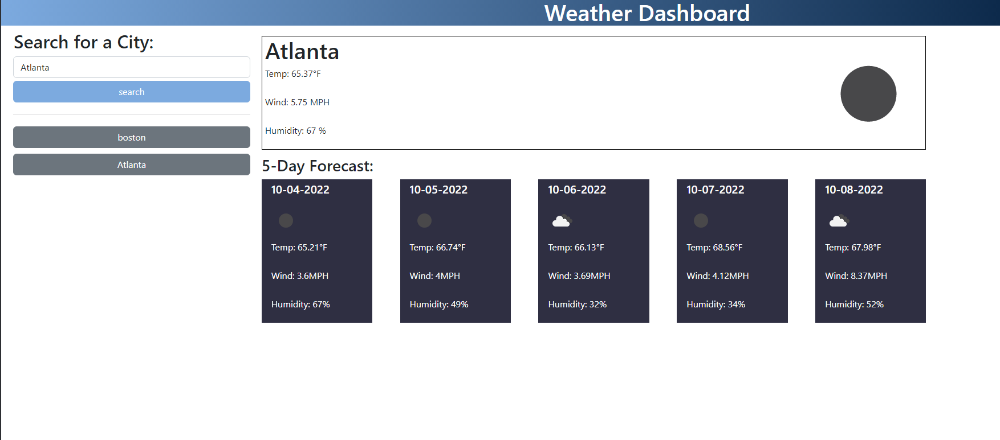

# Khievs-Weather-Dash

This is a website that is show the weather of a location.

## Description

Khiev's Weather Dash: [Link](https://chrissnakhiev.github.io/Khievs-Weather-Dash/)

Khievs-Weather-Dash github: [Link](https://github.com/ChrissnaKhiev/Khievs-Weather-Dash)

This is a website that functions as a weather dashboard.  It displays the current weather as well as the weather of the next 5 days.

## Installation

N/A

## Usage

User enters a location and the website will fetch the data from an api to populate the webpage with data of the desired location.

## Credits

N/A

## License

Please refer to the LICENSE in the repo.